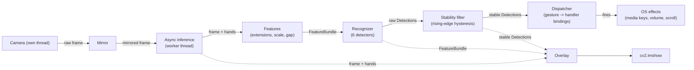

# GestureFlow

Real-time hand-gesture control for the desktop. Wave at your webcam to pause music, scrub volume, scroll, and skip tracks. Built in Python with MediaPipe and OpenCV; designed to feel less like a tech demo and more like a product prototype.

**At a glance**

- **~27 FPS** end-to-end at 1280×720 (camera + inference + recognition + render + display)
- **170 unit tests** in ~0.2 s total, covering the feature math, every detector, every action handler, the stability filter, async-inference threading, and the overlay
- **5 gestures, 5 actions**, all configurable
- **Threaded inference** pulls FPS up 42% over the naive single-threaded pipeline
- **Windows** for now (`pycaw` for audio); cross-platform extension paths documented

---

## Gestures

| Gesture | Pose | Action |
|---|---|---|
| Open palm | All fingers extended | (detected, currently unbound) |
| Fist | All fingers curled | Play / pause |
| Volume slider | Middle, ring, pinky curled — thumb and index free | Volume: thumb-index gap controls level, baseline captured on engage |
| Two fingers | Index + middle up, ring + pinky curled | Vertical drag-scroll wherever the cursor is |
| Swipe left | Open hand, fast leftward motion | Next track (skip forward) |
| Swipe right | Open hand, fast rightward motion | Previous track (skip backward) |

The HUD shows the active gesture, its confidence, per-finger extension bars, FPS, and a flash whenever an OS action fires.

---

## Quick start

You need **python.org Python 3.12** — *not* the Microsoft Store version, which runs in a UWP sandbox that blocks camera access (this took an hour to figure out; saving you the same hour).

```powershell
# Install Python 3.12 (per-user, no admin):
winget install --id Python.Python.3.12 -e

# Disable the Microsoft Store python.exe aliases so `python` resolves
# to the install you just made:
# Settings → Apps → Advanced app settings → App execution aliases
# → toggle off every Python entry

# Clone and set up the venv:
git clone https://github.com/sarilp/GestureFlow.git
cd GestureFlow
& "$env:LOCALAPPDATA\Programs\Python\Python312\python.exe" -m venv .venv
.\.venv\Scripts\Activate.ps1
pip install -e .

# Run:
python main.py
# Press 'q' (with the OpenCV window focused) to quit.
```

If the first run prints `downloading hand_landmarker model …`, that's the ~7 MB MediaPipe model fetching on first use. Cached afterwards.

---

## Architecture



Six layers, each with one job. Solid lines are the dispatch path; dashed lines feed the diagnostic overlay.

| Layer | Module | Purpose |
|---|---|---|
| Capture | [vision/camera.py](vision/camera.py) | Threaded webcam reader with a 1-slot frame buffer |
| Inference | [vision/hand_tracker.py](vision/hand_tracker.py), [vision/async_hand_tracker.py](vision/async_hand_tracker.py) | MediaPipe HandLandmarker, wrapped and pushed to a worker thread |
| Features | [gestures/features.py](gestures/features.py) | Pure functions over `Hand`: finger extensions, hand scale, thumb-index gap |
| Detection | [gestures/static_gestures.py](gestures/static_gestures.py), [gestures/dynamic_gestures.py](gestures/dynamic_gestures.py) | Per-gesture classifiers behind a common `GestureDetector` interface |
| Stabilization | [gestures/state_machine.py](gestures/state_machine.py) | Rising-edge hysteresis on per-gesture streaks |
| Action dispatch | [controls/](controls/) | Gesture-name → `ActionHandler` bindings, each with its own debounce policy |
| Overlay | [ui/overlay.py](ui/overlay.py) | HUD: FPS, gesture labels, per-finger bars, fired-action banner |

---

## Performance

| Metric | Value |
|---|---|
| End-to-end FPS | **~27** |
| Inference latency | ~37 ms (on the worker thread) |
| Main-loop iteration cost | ~7 ms (camera + render + GUI) |
| Frame resolution | 1280 × 720 |
| Camera backend | Windows Media Foundation (MSMF) |
| MediaPipe model | `hand_landmarker.task` (TFLite, ~7 MB) |
| Tests | 170, ~0.2 s wall clock |

**The interesting story behind the FPS number:** the naive single-threaded pipeline gets 19 FPS. The PROFILE log instrumentation showed inference at 45 ms (85% of the frame budget), so we moved inference to a worker thread. Two surprises followed: end-to-end jumped to 27 FPS (predicted ~22 from inference rate alone), and *inference itself* got faster (~37 ms instead of 45 ms) — the previous measurement was inflated by main-loop GIL contention. Once the loops stopped fighting for the GIL, MediaPipe's C++ inference also sped up.

The 30+ FPS goal from the original spec is close but not hit. Further gains would require downscaled inference input or a faster model; neither felt worth the complexity at this performance level.

---

## Design decisions worth a second look

### 1. Hand-scale normalization for depth invariance

Every distance feature (the thumb-index gap that drives volume, the threshold-checks for "this gesture is here") is divided by `hand_scale` — the wrist-to-middle-MCP distance. That's the longest internal hand segment that doesn't change as fingers curl, so it's a flex-invariant ruler.

The payoff is that detection works at *any* camera distance. Without it, every threshold would be tuned to one specific zoom level, and moving 6 inches closer to the camera would break the system. Pinned by [`test_scale_invariance`](tests/test_features.py) — refactor-time guard.

### 2. Composable debounce policies, not inheritance

Each action handler picks its own debounce strategy:

- `PlayPauseAction` uses `CooldownGate`: rising-edge trigger with a refractory period. The right shape for one-shot toggles where a half-second held fist must fire *exactly once*.
- `VolumeAction` uses `RateLimiter`: throughput cap, no edge logic. Fits continuous-while-held control where every frame matters but we don't want to slam pycaw at 27 Hz.
- `ScrollAction` combines `RateLimiter` with a jitter floor: only emit when accumulated motion crosses a minimum delta.

Same `ActionHandler` interface, three different policies, zero shared state. Adding a fourth policy is a new tiny class — no edits to the base or to the dispatcher. [`controls/base.py`](controls/base.py)

### 3. Async inference with replace-on-full coalescing

`HandTracker.process()` runs on a worker thread. The input queue has `maxsize=1`: if the main loop submits a new frame while the worker is still on the previous one, the older queued frame is *replaced*. Backlog is the enemy — we always want the freshest input.

The output bundles `(frame, hands, timestamp, frame_id)` together. The renderer draws landmarks on the *exact* frame they were computed from, so overlays never misalign with the displayed pixels. The frame_id check lets the main loop skip redundant rendering when inference hasn't produced new results yet.

Coalescing is pinned by [`test_rapid_submits_coalesce_to_latest`](tests/test_async_hand_tracker.py): submit 10 frames while the worker is blocked, then release — the worker must process far fewer than 11 frames and pick up the *most recent* submission. Without this invariant, refactoring the queue silently re-introduces unbounded backlog. [`vision/async_hand_tracker.py`](vision/async_hand_tracker.py)

### 4. Stateless detectors, stateful tracker

Static detectors (`open_palm`, `fist`, `pinch`, `two_fingers`) are pure functions of one `Hand`. Easy to test, easy to reason about.

Swipe detection needs motion history — but only because *one specific feature* (recent x-velocity) is stateful. So `MotionTracker` is a separate object that holds the buffers, and dynamic detectors read a `MotionSnapshot` through the same `FeatureBundle` static detectors use. The dynamic detector's `detect()` method is still stateless from its own perspective — the state is just in a different module.

This kept the detector interface uniform across static and dynamic, which means the `StabilityFilter` and `ActionDispatcher` don't need to know which kind they're processing. [`gestures/motion.py`](gestures/motion.py), [`gestures/dynamic_gestures.py`](gestures/dynamic_gestures.py)

### 5. Volume as a virtual slider, not an absolute mapping

First-pass design mapped pinch tightness directly to system volume. Result: every engagement *jumped* the volume to whatever the tightness implied, then required fine motor control on a continuous range. Awful UX.

Current design captures `(current_volume, current_thumb_index_gap)` on the rising edge of the gesture, then tracks volume *relative to that baseline*. Engaging at any gap doesn't move the volume; spreading thumb and index raises it; closing them lowers it; releasing locks the current value in. Bidirectional, anchored, no jumps. [`controls/audio.py`](controls/audio.py)

### 6. Rising-edge hysteresis at one layer, not many

Per-gesture stability lives in one place: [`gestures/state_machine.py`](gestures/state_machine.py). A detection must persist for `rising_frames` consecutive frames before downstream layers see it. Filter MediaPipe landmark noise *once*, at the boundary between "raw detection" and "this gesture is real."

Falling-edge hysteresis (keeping a gesture "live" briefly after it disappears) is deliberately *not* included. Continuous handlers need fresh per-frame data once engaged — stale-data padding makes them feel laggy. The handler-level state-release behavior (Volume disengages when `None` is passed) is the right place for that concern.

---

## Testing

```powershell
.\.venv\Scripts\python.exe -m unittest discover -s tests
```

170 tests, ~0.2 seconds total. Highlights:

- **Pure feature math** — distance, scale, finger-extension formulas. 12 tests including a 3-4-5 triangle sanity check and the scale-invariance proof.
- **Detector cross-rejection matrix** — each detector fires on its target pose and rejects every other canonical pose. Catches calibration drift across refactors.
- **Action handlers exercised through injected backends** — `PlayPauseAction` with a fake `key_press`, `VolumeAction` with an in-memory `_FakeAudio`, `ScrollAction` with a recording scroll function. Tests verify state transitions, cooldown semantics, baseline-rebasing, jitter-floor accumulation. Never touch the OS.
- **Threaded code with a controllable mock tracker** — `AsyncHandTracker` tests gate the mock's `process()` call so we can observe "worker has picked up the frame" while it's still inside processing, then assert on coalescing behavior.

Test files map 1:1 to source modules: `tests/test_features.py`, `tests/test_detectors.py`, etc. The factory module `tests/_factories.py` provides 21-landmark `Hand` builders for the canonical poses (open palm, fist, pinch-slider pose, two fingers).

---

## Project layout

```
gestureflow/
├── main.py                      # entry point, pipeline orchestration
├── config.py                    # dataclass-based configuration
├── pyproject.toml               # package metadata
├── requirements.txt             # pinned dependencies (rationale in comments)
├── vision/
│   ├── camera.py                # threaded webcam capture
│   ├── hand_tracker.py          # MediaPipe HandLandmarker wrapper
│   └── async_hand_tracker.py    # worker-thread inference + coalescing
├── gestures/
│   ├── features.py              # finger extensions, hand scale, thumb-index gap
│   ├── base.py                  # GestureDetector ABC, FeatureBundle, Detection
│   ├── static_gestures.py       # open palm, fist, pinch (slider), two fingers
│   ├── dynamic_gestures.py      # swipe left/right
│   ├── motion.py                # per-hand motion history
│   ├── recognizer.py            # detector orchestrator
│   └── state_machine.py         # rising-edge stability filter
├── controls/
│   ├── base.py                  # ActionHandler ABC + CooldownGate, RateLimiter
│   ├── dispatcher.py            # routes detections to handlers
│   ├── media.py                 # play/pause, skip forward/back
│   ├── audio.py                 # system volume via pycaw
│   └── scroll.py                # vertical scroll via pynput
├── ui/
│   └── overlay.py               # HUD rendering
├── utils/
│   ├── logger.py                # structured logging setup
│   ├── timers.py                # FPS counter (EMA)
│   └── stage_timer.py           # per-stage profiling
├── tests/
│   ├── _factories.py            # synthetic Hand builders
│   └── test_*.py                # 170 unit tests
└── tools/
    └── diagnose_swipe.py        # standalone gate-by-gate swipe diagnostic
```

---

## Known limitations and what they'd take to fix

- **Windows only.** `pycaw` is a Windows Core Audio binding. macOS and Linux audio would need a `CoreAudio` bridge or `amixer`/`pactl` shell-outs. The volume `_get_volume` / `_set_volume` callable injection points are already there — just need platform-specific implementations.
- **`mediapipe==0.10.21` pinned exactly.** Newer wheels have broken ctypes bindings on Windows; the legacy `solutions` API is gone post-0.10.30. The Tasks-API wrapper in `vision/hand_tracker.py` would let us upgrade once Google ships a fixed Windows build.
- **27 FPS, not 30+.** Further FPS gains require either downscaling the input frame to MediaPipe (small accuracy cost) or upgrading hardware. The architectural wins (threading, coalescing) are done.
- **`open_palm` is detected but unbound.** No action assigned. Reserved as a future arming/disarming toggle if you ever want a "system on/off" meta-control.
- **`Detection.metadata: dict[str, Any]` is type-loose.** `VolumeAction` reads `metadata["pinch_ratio"]`; if `PinchDetector` ever stops emitting that key, the handler logs a warning and no-ops. Real fix: typed metadata per detector. Phase-6-cleanup material.

---

## License

MIT.
